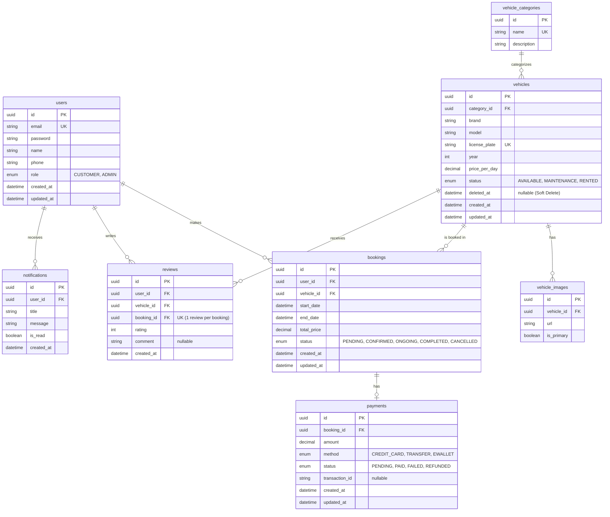

# Desain Database Aplikasi Rental Mobil

Dokumen ini berisi rancangan skema database untuk aplikasi rental mobil skala *production* dengan mempertimbangkan konsistensi data, pencegahan *double-booking*, dan jejak audit historis.

## 1. Evaluasi Entitas (Entity Evaluation)

Dari 11 entitas yang diusulkan, berikut adalah hasil evaluasi dan penyederhanaannya:

1.  `users` -> **DIPERTAHANKAN**
2.  `roles` -> **DIHAPUS**. Menggunakan tipe ENUM (`CUSTOMER`, `ADMIN`) di dalam tabel `users` jauh lebih efisien dan mengurangi `JOIN` yang tidak perlu untuk aplikasi dengan dua *role* statis.
3.  `vehicles` -> **DIPERTAHANKAN**
4.  `vehicle_categories` -> **DIPERTAHANKAN**
5.  `vehicle_images` -> **DIPERTAHANKAN**
6.  `vehicle_pricing` -> **DIHAPUS**. Untuk menjaga kesederhanaan *MVP*, harga harian (harga dasar) disimpan sebagai kolom `price_per_day` di tabel `vehicles`. Harga final saat *booking* akan di- *snapshot* ke tabel `bookings`.
7.  `bookings` -> **DIPERTAHANKAN**
8.  `booking_items` -> **DIHAPUS**. Dalam bisnis rental mobil standar, 1 transaksi/booking umumnya merepresentasikan 1 mobil dengan rentang waktu spesifik. Menggabungkan `vehicle_id` langsung ke tabel `bookings` mempermudah validasi *overlapping dates* (mencegah *double booking*).
9.  `payments` -> **DIPERTAHANKAN**
10. `reviews` -> **DIPERTAHANKAN**
11. `notifications` -> **DIPERTAHANKAN**

## 2. Entity Relationship Diagram (ERD)

## 3. Analisis Kebutuhan Spesifik

### 1. Vehicle Availability
Ketersediaan tidak disimpan sebagai *flag* statis (true/false) yang mudah tidak sinkron. Ketersediaan pada tanggal tertentu dihitung secara dinamis (*derived state*) dengan mengecek tabel `bookings` untuk melihat apakah ada booking berstatus `CONFIRMED` atau `ONGOING` yang bersinggungan dengan tanggal yang diminta, serta mengecek status fisik mobil di tabel `vehicles` (apakah `MAINTENANCE`).

### 2. Booking Date Overlap & Double Booking Prevention
- **Database Constraint (PostgreSQL):** Selain mengecek di sisi aplikasi (Prisma), kita akan menggunakan *Exclusion Constraint* bawaan PostgreSQL (menggunakan ekstensi `btree_gist`).
- Constraint: `EXCLUDE USING gist (vehicle_id WITH =, tstzrange(start_date, end_date) WITH &&)`
- **Dampak:** Memastikan di level *database engine* bahwa tidak mungkin ada dua *booking* untuk `vehicle_id` yang sama yang rentang waktunya saling tumpang tindih. Ini adalah cara teraman mencegah *double booking* saat *race conditions*.

### 3. Booking Status
Menggunakan kolom bertipe ENUM:
- `PENDING`: Menunggu pembayaran.
- `CONFIRMED`: Dibayar, menunggu waktu sewa.
- `ONGOING`: Mobil sedang digunakan oleh *customer*.
- `COMPLETED`: Mobil telah dikembalikan.
- `CANCELLED`: Dibatalkan oleh *customer* atau sistem (karena kedaluwarsa).

### 4. Payment Status
Menggunakan kolom bertipe ENUM (`PENDING`, `PAID`, `FAILED`, `REFUNDED`).
*   Terpisah dari *Booking status* karena satu *booking* berstatus `CANCELLED` mungkin memiliki *payment* berstatus `REFUNDED`.

### 5. Cancellation
- Tidak ada data *booking* yang dihapus secara fisik (hard delete).
- Pembatalan murni merupakan perubahan `status` menjadi `CANCELLED`. Ini menjaga histori pembatalan untuk analisis Admin.

### 6. Pricing (Historical Integrity)
- Harga mobil sewaktu-waktu bisa naik/turun oleh Admin.
- Untuk mencegah rusaknya data masa lalu, saat *booking* dibuat, `price_per_day` saat itu disalin dan dikalikan durasi sewa, lalu disimpan statis di kolom `total_price` pada tabel `bookings`.

### 7. Customer Ownership
- Setiap `bookings`, `payments`, `reviews`, dan `notifications` memiliki `user_id` (Foreign Key).
- Otorisasi aplikasi akan selalu menambahkan klausul `WHERE user_id = {session.userId}` pada setiap kueri `SELECT` agar pelanggan hanya melihat miliknya.

### 8. Admin Access & Soft Delete
- Admin dapat melihat semua data (kueri tanpa filter `user_id`).
- Jika Admin ingin menghapus mobil (`vehicles`) yang sudah memiliki riwayat pemesanan, kita tidak boleh menggunakan `DROP/DELETE` karena akan merusak *constraint Foreign Key* dari tabel `bookings`. 
- **Solusi:** Tabel `vehicles` menggunakan `deleted_at` (Soft Delete). Kueri katalog publik akan menambahkan filter `WHERE deleted_at IS NULL`.

## 4. Metadata Skema Lanjutan

- **Primary Keys:** `UUID` v4 untuk semua tabel guna mencegah *enumeration attack* (tebak-tebakan ID).
- **Indexes:** 
  - `idx_bookings_vehicle_dates` pada tabel `bookings` (`vehicle_id`, `start_date`, `end_date`).
  - `idx_users_email` (Unique Index).
  - `idx_bookings_user_id`.
- **Normalization:** Skema ini mencapai *3rd Normal Form (3NF)*. Tidak ada duplikasi data selain Foreign Keys dan nilai historis (*snapshot* harga).
